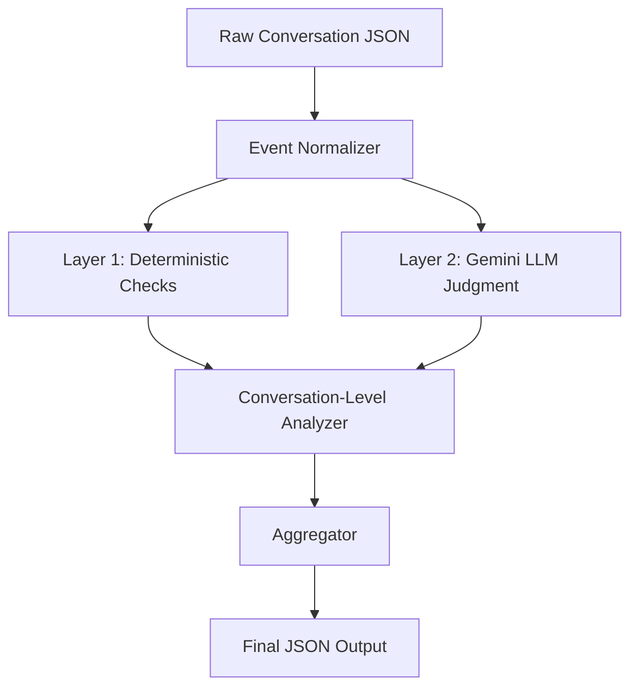

# Hybrid Evaluator: Deterministic Core + Gemini LLM Judgment



---

# Layer 1 — Deterministic Validators (Exact Reasoning)

Layer 1 checks are **binary or computed** — we know precisely what broke, where it broke, and why. No rubric needed. Each violation carries a **fixed severity** derived directly from the spec's severity classification (Section 11).

## 1. State Transition Validator

### Input
- `state_transitions[]` — list of `{turn, from_state, to_state, reason}`
- `bot_classifications[]` — list of `{turn, classification, confidence}`
- `function_calls[]` — list of `{turn, function, params}`
- `messages[]` — to detect post-exit-state messages

### Transition Matrix (Hard-Coded)

```python
ALLOWED_TRANSITIONS = {
    "new":                  {"message_received"},
    "message_received":     {"verification"},
    "verification":         {"intent_asked"},
    "intent_asked":         {"settlement_explained"},
    "settlement_explained": {"amount_pending", "intent_asked"},  # * backward exception
    "amount_pending":       {"amount_sent", "intent_asked"},     # * backward exception
    "amount_sent":          {"date_amount_asked"},
    "date_amount_asked":    {"payment_confirmed"},
    "payment_confirmed":    set(),  # no forward transitions
}
# Every progression state can also → escalated, dormant
# Every progression state can → payment_confirmed on payment_received event
# Exit states (escalated, dormant) → nothing
```

### Exact Checks & Reasoning

#### Check 1: Illegal State Transition
```
IF (to_state NOT IN ALLOWED_TRANSITIONS[from_state])
   AND (to_state NOT IN {"escalated", "dormant"})
   AND NOT (payment_received event → payment_confirmed):
   
   VIOLATION:
     rule: "Section 4 — Transition Matrix"
     severity: 0.8 (High)
     explanation: f"Illegal transition {from_state} → {to_state} at turn {turn}. 
                   Allowed targets from {from_state}: {ALLOWED_TRANSITIONS[from_state]}"
```

#### Check 2: Invalid Backward Transition
```
IF state_order(to_state) < state_order(from_state):
   IF (from_state IN {"settlement_explained", "amount_pending"} 
       AND to_state == "intent_asked"
       AND classification == "unclear" AND confidence == "low"):
       → ALLOWED (exception from Section 4.7)
   ELSE:
       VIOLATION:
         rule: "Invariant I1 — No Going Backwards"
         severity: 0.8 (High)
         explanation: f"Backward transition {from_state} → {to_state} at turn {turn}. 
                       Only settlement_explained/amount_pending → intent_asked allowed 
                       when classification=unclear+low."
```

#### Check 3: Exit State Finality
```
AFTER conversation enters "escalated" or "dormant":
   IF any bot message exists with timestamp > exit_timestamp:
       VIOLATION:
         rule: "Invariant I2 — Exit States Are Final"
         severity: 1.0 (Critical)
         explanation: f"Bot sent message at turn {turn} after entering {exit_state} 
                       at turn {exit_turn}. No messages allowed after exit."
```

#### Check 4: Action-State Mismatch
```python
VALID_ACTION_TRANSITIONS = {
    "request_settlement_amount": ("settlement_explained", "amount_pending"),
    "send_settlement_amount":    ("amount_pending", "amount_sent"),
    "confirm_payment":           ("date_amount_asked", "payment_confirmed"),
    "escalate":                  (ANY, "escalated"),
    "zcm_timeout":               ("amount_pending", "escalated"),
}

IF action called BUT current transition doesn't match expected (from, to):
    VIOLATION:
      rule: "Invariant I4 — Actions Must Match States"
      severity: 0.8 (High)
      explanation: f"Action '{action}' called at turn {turn} during transition 
                    {from_state} → {to_state}. Expected transition: {expected}."
```

#### Check 5: Missing Escalation on Trigger Classification
```
IF classification IN {"disputes", "refuses", "hardship"}
   AND no subsequent transition to "escalated":
   
   VIOLATION:
     rule: "Section 4.3 — Escalation Requirements"
     severity: 0.8 (High)
     explanation: f"Borrower classified as '{classification}' at turn {turn} but 
                    conversation was not escalated. Spec requires escalation for 
                    {disputes/refuses/hardship}."
```

#### Check 6: ZCM Timeout Handling
```
IF state == "amount_pending" AND zcm_timeout event occurs:
   IF next transition is NOT → "escalated":
       VIOLATION:
         rule: "Section 4.6 — ZCM Timeout"
         severity: 0.8 (High)
         explanation: "ZCM timeout occurred during amount_pending but conversation 
                       was not escalated."
```

---

## 2. Timing Validator

### Input
- `messages[]` — with `{role, timestamp, turn}`
- `state_transitions[]` — to know current state
- All timestamps treated as IST (UTC+5:30)

### Exact Checks & Reasoning

#### Check 1: Quiet Hours Violation
```
FOR each bot message:
    hour = message.timestamp.hour (IST)
    IF hour >= 19 OR hour < 8:  # 7 PM to 8 AM
        # Check if this is a REPLY (borrower message exists within last 30 min)
        last_borrower_msg = most recent borrower message before this bot message
        IF last_borrower_msg is None OR time_gap > 30 minutes:
            VIOLATION:
              rule: "Section 6.1 — Quiet Hours"
              severity: 0.6 (Medium-High)
              explanation: f"Bot sent outbound message at {timestamp} IST 
                            (quiet hours: 7PM-8AM). No recent borrower message 
                            to justify reply."
        ELSE:
            → OK (reply during quiet hours is allowed)
```

#### Check 2: Follow-Up Spacing
```
FOR consecutive bot messages with no borrower response between them:
    gap = msg2.timestamp - msg1.timestamp
    IF gap < 4 hours (240 minutes):
        VIOLATION:
          rule: "Section 6.2 — Follow-Up Spacing"
          severity: 0.5 (Medium)
          explanation: f"Bot sent follow-up at turn {turn2} only {gap_mins} minutes 
                        after unanswered message at turn {turn1}. Minimum 4 hours required."
```

#### Check 3: Missing Dormancy Transition
```
last_borrower_msg = latest borrower message timestamp
last_event = latest event in conversation
gap = last_event - last_borrower_msg

IF gap > 7 days (10,080 minutes) AND final_state NOT IN {"dormant", "escalated", "payment_confirmed"}:
    VIOLATION:
      rule: "Section 6.3 — Dormancy Timeout"
      severity: 0.7 (High)
      explanation: f"Borrower last responded {days} days ago but conversation 
                    not marked dormant. Should transition to dormant after 7 days."
```

---

## 3. Amount Validator

### Input
- `metadata` — `{pos, tos, settlement_offered}`
- `function_calls[]` — params with amounts
- `messages[]` — to extract quoted amounts from bot text

### Exact Checks & Reasoning

#### Check 1: POS > TOS (Data Integrity)
```
IF metadata.pos > metadata.tos:
    VIOLATION:
      rule: "Amount Rule A1 — POS ≤ TOS"
      severity: 0.8 (High)
      explanation: f"POS ({pos}) > TOS ({tos}). This indicates data corruption."
```

#### Check 2: Settlement Exceeds TOS
```
IF metadata.settlement_offered > metadata.tos:
    VIOLATION:
      rule: "Amount Rule A3 — Settlement ≤ TOS"
      severity: 0.8 (High)
      explanation: f"Settlement offered ({settlement}) exceeds TOS ({tos})."
```

#### Check 3: Suspiciously Low Settlement (Heuristic Floor)
```
IF metadata.settlement_offered < 0.5 * metadata.pos:
    VIOLATION:
      rule: "Amount Rule A4 — Below Floor (heuristic)"
      severity: 0.4 (Medium, soft)
      explanation: f"Settlement ({settlement}) is below 50% of POS ({pos}). 
                    May be below settlement floor. Cannot verify exactly 
                    (floor not in data)."
```

#### Check 4: Amount Consistency
```
Extract all ₹ amounts mentioned in bot messages via regex.
IF multiple distinct amounts quoted AND no ZCM re-approval between them:
    VIOLATION:
      rule: "Amount Rule A5 — Consistency"
      severity: 0.6 (Medium-High)
      explanation: f"Bot quoted inconsistent amounts: {amounts}. Once a settlement 
                    is quoted, it must remain consistent unless re-approved."
```

---

# Layer 2 — Gemini LLM Evaluators (Rubric-Based Judgment)

Each module sends a **structured prompt** to `gemini-3.1-pro-preview`. The prompt contains:
1. The **relevant spec section** (verbatim)
2. The **rubric definition** (what each score means)
3. The **conversation data** (normalized turns)
4. A **JSON output format** requirement

---

## 4. Compliance Evaluator (Rubric: 1–5)

### What It Assesses
Soft compliance issues that require **semantic understanding** — not binary rule matches.

### LLM Prompt Template

```
You are evaluating a WhatsApp debt collection conversation for compliance with 
regulatory and ethical rules. 

## Spec Rules (Section 8 — Compliance Requirements)

### Escalation Triggers
The agent MUST escalate to a human when the borrower's message contains:
- Legal threats or references to regulatory bodies
- Explicit requests to stop communication ("stop", "do not contact me", "leave me alone")
- Abusive or hostile language directed at the agent
- Disclosure of severe financial hardship or personal crisis

Not every mention of difficulty is grounds for escalation. But clear signals of 
distress, legal intent, or communication refusal MUST be acted on.

### Hardship Handling
When a borrower mentions financial hardship (job loss, medical emergency, family crisis):
1. The agent MUST acknowledge the situation with empathy.
2. The agent must NOT immediately push for payment in the same or next message.
3. If the hardship is severe, the agent should escalate to a human.

### Do Not Contact (DNC)
If the borrower explicitly asks to stop all communication, the agent must immediately 
escalate and NEVER send another message. Violating DNC is a serious compliance failure.

### Language Matching
The agent must respond in the borrower's preferred language. Responding in English 
to a Hindi-speaking borrower is a compliance failure.

### No Threats
The agent must never threaten legal action, property seizure, or public embarrassment,
use coercive or intimidating language, or imply consequences beyond what is factually 
accurate.

## Rubric (1–5 Scale)

Score each compliance dimension found:

| Score | Label    | Meaning |
|-------|----------|---------|
| 1     | Clean    | No compliance issue detected in this dimension |
| 2     | Minor    | Technically imperfect but unlikely to cause harm (e.g., slight language mix) |
| 3     | Moderate | Clear compliance gap but not immediately dangerous (e.g., hardship acknowledged but empathy was weak) |
| 4     | Serious  | Likely to cause borrower distress or complaint (e.g., payment push after hardship disclosure) |
| 5     | Critical | Regulatory violation or certain complaint trigger (e.g., DNC ignored, threats made, abuse unaddressed) |

## Conversation

{conversation_turns_json}

## Instructions

Analyze each turn for compliance issues. For each issue found, report:
- Which turn it occurred at
- Which compliance dimension was violated
- Your rubric score (1-5) with reasoning
- What the agent should have done instead

Respond in this exact JSON format:
{
  "findings": [
    {
      "turn": <int>,
      "dimension": "escalation_trigger" | "hardship_handling" | "dnc_violation" | 
                   "language_mismatch" | "threat_or_coercion",
      "rubric_score": <1-5>,
      "reasoning": "<why this score>",
      "expected_behavior": "<what should have happened>"
    }
  ],
  "overall_compliance_score": <1-5>,
  "summary": "<1-2 sentence overall assessment>"
}
```

### Input to LLM
A cleaned view of the conversation with:
- All messages (role, text, timestamp, turn)
- Bot classifications (what the bot thought the borrower meant)
- State transitions (so LLM can see if escalation happened)
- Metadata (language, zone)

### Score Semantics
| Overall Score | Normalized | What It Means |
|--------------|-----------|---------------|
| 1 (Clean) | 0.0 | Fully compliant conversation |
| 2 (Minor) | 0.25 | Small gaps, no regulatory risk |
| 3 (Moderate) | 0.5 | Compliance gaps, low complaint risk |
| 4 (Serious) | 0.75 | Likely complaint, regulatory attention |
| 5 (Critical) | 1.0 | Certain regulatory failure |

---

## 5. Quality Evaluator (Rubric: 1–3)

### What It Assesses
Conversation quality — how well the agent communicates, not whether it broke hard rules.

### LLM Prompt Template

```
You are evaluating the quality of a WhatsApp debt collection agent's communication.

## Spec Rules (Section 10 — Quality Expectations)

Q1. Efficient Progress: A good conversation reaches payment_confirmed or an appropriate 
    exit state without too many turns. Going in circles = quality problem.

Q2. Accurate Classification: The agent's classification of borrower intent should match 
    what the borrower actually said. Repeatedly classifying clear messages as "unclear" 
    is a classification problem.

Q3. Appropriate Tone: Tone should match the situation. Being transactional when borrower 
    is in distress is bad. Being aggressive with a cooperative borrower is bad.

Q4. Remembering Context: Agent should not repeat itself, re-ask questions already asked, 
    or forget earlier context.

Q5. No Repetition: Agent should not send identical or near-identical messages. Repeated 
    messages suggest the agent is stuck in a loop. Severity increases with repetitions.

## Rubric (1–3 Scale)

For each quality dimension, score:

| Score | Label    | Meaning |
|-------|----------|---------|
| 1     | Good     | Meets expectations for this dimension |
| 2     | Poor     | Noticeable quality gap, affects borrower experience |
| 3     | Failing  | Severe quality failure, conversation is ineffective or harmful |

## Conversation

{conversation_turns_json}

## Bot Classifications

{classifications_json}

## Instructions

Evaluate each quality dimension (Q1-Q5). For dimensions where issues exist, 
identify the specific turns involved.

Respond in this exact JSON format:
{
  "dimensions": {
    "Q1_efficient_progress": {
      "score": <1-3>,
      "reasoning": "<why>",
      "problem_turns": [<turn numbers if any>]
    },
    "Q2_accurate_classification": {
      "score": <1-3>,
      "reasoning": "<why>",
      "problem_turns": [<turn numbers if any>]
    },
    "Q3_appropriate_tone": {
      "score": <1-3>,
      "reasoning": "<why>",
      "problem_turns": [<turn numbers if any>]
    },
    "Q4_context_retention": {
      "score": <1-3>,
      "reasoning": "<why>",
      "problem_turns": [<turn numbers if any>]
    },
    "Q5_no_repetition": {
      "score": <1-3>,
      "reasoning": "<why>",
      "problem_turns": [<turn numbers if any>]
    }
  },
  "overall_quality_score": <1-3>,
  "summary": "<1-2 sentence assessment>"
}
```

### Score Semantics
| Overall Score | Normalized | What It Means |
|--------------|-----------|---------------|
| 1 (Good) | 0.0 | High quality, effective communication |
| 2 (Poor) | 0.5 | Multiple quality gaps, borrower likely frustrated |
| 3 (Failing) | 1.0 | Conversation is broken/useless |

---

## 6. Classification Accuracy Checker (Rubric: 1–3)

### What It Assesses
Whether the bot's intent classification of borrower messages is correct. This is spec invariant I5.

### LLM Prompt Template

```
You are checking whether a debt collection bot correctly classified borrower messages.

## Classification Categories (from spec)
- unclear: Borrower's intent could not be determined
- wants_settlement: Borrower wants to pay a reduced amount
- wants_closure: Borrower wants to pay the full amount
- refuses: Borrower is refusing to pay
- disputes: Borrower is disputing the debt or amount owed
- hardship: Borrower is reporting financial difficulty
- asks_time: Borrower is asking for more time before paying

## Rules
- Every borrower message must be classified into exactly one category (Invariant I5)
- If a borrower clearly says "I can't pay, I lost my job" → should be "hardship", not "unclear"
- If a borrower says "I want to settle" → should be "wants_settlement", not "unclear"
- Overuse of "unclear" for clear messages is a classification error

## Rubric (1–3 Scale)

| Score | Label     | Meaning |
|-------|-----------|---------|
| 1     | Correct   | Classification matches expressed intent |
| 2     | Debatable | Classification is plausible but another label fits better |
| 3     | Wrong     | Classification clearly misses the borrower's actual intent |

## Borrower Messages & Bot Classifications

{classifications_with_text_json}

## Instructions

For each classified borrower message:
1. Read the borrower's actual text
2. Determine what the correct classification should be
3. Compare with the bot's classification
4. Score accuracy using the rubric

Respond in this exact JSON format:
{
  "turn_evaluations": [
    {
      "turn": <int>,
      "borrower_text": "<text>",
      "bot_classification": "<what bot said>",
      "correct_classification": "<what you think it should be>",
      "accuracy_score": <1-3>,
      "reasoning": "<why>"
    }
  ],
  "overall_accuracy_score": <1-3>,
  "misclassification_rate": <float 0-1>,
  "summary": "<assessment>"
}
```

---

# Conversation-Level Analyzers (Deterministic)

## 7. Loop / Stuck Detection

Deterministic — uses `difflib.SequenceMatcher` to detect near-identical bot messages:

```
FOR pairs of bot messages (i, j) where j > i:
    similarity = SequenceMatcher(msg_i.text, msg_j.text).ratio()
    IF similarity > 0.85:
        consecutive_repeats += 1

IF consecutive_repeats >= 3:
    VIOLATION:
      rule: "Quality Q5 — Repetition / Stuck Loop"
      severity: min(1.0, 0.3 + consecutive_repeats * 0.1)  # scales with depth
      explanation: f"Bot sent {consecutive_repeats} near-identical messages 
                    (similarity > 85%). Agent appears stuck in a loop."
```

---

# Aggregator — Final Scoring

```python
def compute_quality_score(violations):
    """Start at 1.0, deduct based on violations."""
    score = 1.0
    for v in violations:
        weight = CATEGORY_WEIGHTS[v["category"]]  # e.g., compliance=0.3, quality=0.2
        score -= v["severity"] * weight
    return max(0.0, min(1.0, score))

def compute_risk_score(violations):
    """Risk driven by worst-case violations."""
    if any(v["severity"] >= 0.9 for v in violations):
        return max(0.8, ...)  # Critical violation → high risk
    if any(v["severity"] >= 0.7 for v in violations):
        return max(0.5, ...)  # High violation → moderate risk
    return sum(v["severity"] * 0.1 for v in violations)
```

### Category Weights for Quality Score Deductions

| Category | Weight | Rationale |
|----------|--------|-----------|
| State integrity | 0.25 | Core spec correctness |
| Compliance | 0.30 | Regulatory risk — highest weight |
| Timing | 0.10 | Important but lower impact |
| Amounts | 0.15 | Financial accuracy matters |
| Quality | 0.10 | Soft expectations |
| Classification | 0.10 | Affects downstream decisions |

---

## File Structure

```
riverline/
├── eval_takehome.py              # [MODIFY] Orchestrator
├── normalizer.py                 # [NEW] Event normalization
├── validators/
│   ├── __init__.py               # [NEW]
│   ├── state_validator.py        # [NEW] 6 exact checks
│   ├── timing_validator.py       # [NEW] 3 exact checks
│   └── amount_validator.py       # [NEW] 4 exact checks
├── evaluators/
│   ├── __init__.py               # [NEW]
│   ├── gemini_client.py          # [NEW] API client
│   ├── compliance_evaluator.py   # [NEW] Rubric 1-5
│   ├── quality_evaluator.py      # [NEW] Rubric 1-3
│   └── classification_checker.py # [NEW] Rubric 1-3
└── test_evaluator.py             # [NEW]
```

## Verification Plan

1. `python3 test_evaluator.py` — test both sample conversations
2. `python3 eval_takehome.py` — first 10 production logs
3. Spot-check Gemini LLM responses for coherence
4. Compare our quality_score vs annotator quality_score on overlapping set
